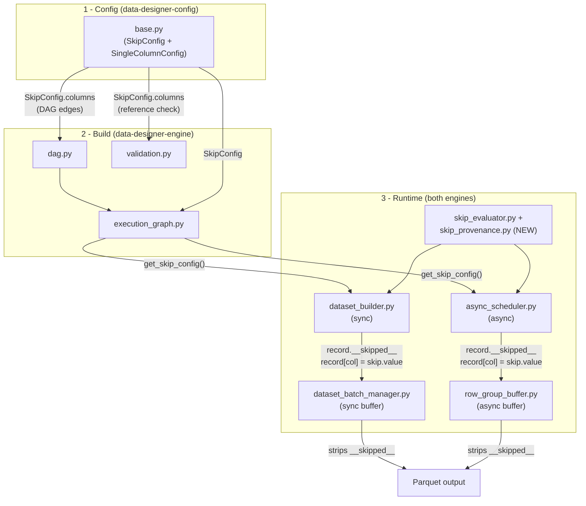
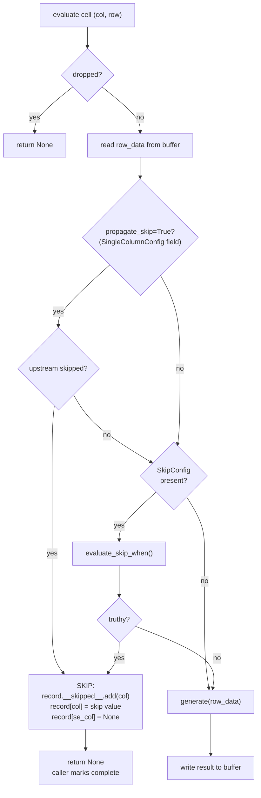

# Plan: Conditional column generation — `SkipConfig` / `skip.when`

Historical note: this plan records the pre-#766 design. References to `allow_resize` below describe behavior that has since been removed from the config schema and engine.

## Problem

DataDesigner's DAG executes every column for every row unconditionally. In multi-stage synthesis pipelines, expensive downstream generation (LLM calls, segmentation, etc.) runs even when an earlier gate column indicates the row should be filtered out.

Today the only workarounds are:

1. **Generate all columns unconditionally and post-filter** — wastes LLM calls on rows that will be discarded.
2. **Split into multiple `DataDesigner.create()` calls** with intermediate filtering — loses single-pipeline ergonomics and forces the user to manage seed-dataset hand-offs.

## Proposed Solution

Add a `SkipConfig` model and an optional `skip` field on `SingleColumnConfig`. When the `skip.when` Jinja2 expression evaluates truthy for a row, the cell is set to `skip.value` (default `None`) and the generator is never called.

Independently, a `propagate_skip` field on `SingleColumnConfig` (default `True`) controls whether a column auto-skips when any of its upstream dependencies were skipped. This is a separate concern from expression gating: a column with no `SkipConfig` at all will still auto-skip if an upstream was skipped, unless it opts out with `propagate_skip=False`.

Example: a pipeline that generates product reviews only for items in stock. The `sentiment_analysis` and `review` columns are expensive LLM calls that should be skipped for out-of-stock items:

```python
config_builder.add_column(
    dd.SamplerColumnConfig(
        name="in_stock",
        sampler_type="bernoulli",
        params=BernoulliSamplerParams(p=0.7),
    )
)
config_builder.add_column(
    dd.LLMStructuredColumnConfig(
        name="sentiment_analysis",
        skip=dd.SkipConfig(when="{{ in_stock == 0 }}"),
        prompt="Analyze the sentiment of reviews for {{ product_name }}...",
        ...
    )
)
# review depends on sentiment_analysis via its prompt template.
# propagate_skip=True (the default) means it auto-skips when sentiment_analysis is skipped.
# No SkipConfig needed — propagation is independent of expression gating.
config_builder.add_column(
    dd.LLMTextColumnConfig(
        name="review",
        prompt="Write a {{ sentiment_analysis.tone }} review for {{ product_name }}...",
    )
)
```

Skipped rows stay in the output (row count is preserved). Skipped cells contain `skip.value` (default `None`).

## Design Decisions

| Decision | Choice | Rationale |
|---|---|---|
| Where does skip config live? | Nested `SkipConfig` model on `SingleColumnConfig` via `skip: SkipConfig \| None = None`, **validated to reject sampler/seed types** | Groups the expression gate (`when`) and its fill value (`value`) into a self-contained model. Sampler/seed columns are collapsed into shared multi-column generators at compile time — no per-row dispatch point to skip individual columns. Scope v1 to generated single-column configs only. Placing fields on `SingleColumnConfig` (not an LLM-only base) keeps **`CustomColumnConfig` / plugins** on the same engine path without duplicating `skip` on a parallel inheritance branch. |
| What happens to skipped cells? | Set to `skip.value` (default `None`), row stays in output | Rows are not dropped — users can post-filter or inspect. `skip.value` is configurable per-column to handle dtype constraints (e.g., `value=0` for numeric columns, `value=""` for string columns). |
| Do downstream columns auto-skip? | Yes by default via `propagate_skip=True` on `SingleColumnConfig`, opt-out with `propagate_skip=False` | Propagation is **independent of `SkipConfig`** — a column with no expression gate still auto-skips when an upstream was skipped. This ensures columns that depend on a gated column don't silently receive null inputs. Templates like `{{ 'unknown' if country is none else country\|upper }}` handle missing data fine and can opt out with `propagate_skip=False`. Setting `propagate_skip=False` suppresses *all* upstream skip signals — including future #362 runtime failures — not just expression-gated skips. |
| How are skip columns ordered in the DAG? | `skip.columns` (parsed from `skip.when`) become DAG edges | Ensures the gate column is generated before the guarded column |
| How does this interact with `_records_to_drop`? | Independently — skip does not drop rows | Skip produces `skip.value`; drop removes the row entirely |
| How does this interact with `allow_resize`? | **Blocked for v1** — validation rejects `skip` + `allow_resize` on the same column | `allow_resize` changes the buffer size during generation (1:N or N:1 patterns), which invalidates index-based skip tracking. Blocking the combination avoids complex index remapping. If needed later, the two features can be composed by running resize after skip provenance is finalized. |
| What Jinja2 expression format does `skip.when` use? | Stored value **includes** `{{ }}` delimiters (e.g., `when="{{ in_stock == 0 }}"`) | Aligns with the rest of the codebase (prompts, expressions). The evaluator renders the stored value directly — it does **not** wrap it. `SkipConfig.columns` parses the stored value as-is, which correctly extracts undeclared variables from `{{ }}` expressions. |

---

## Architecture

### System overview

The feature touches three layers. Each box below is a file; arrows show data/control flow.



### Per-cell skip evaluation (both engines)



---

## Implementation

### 1. Config: `SingleColumnConfig` — add fields + property

**File:** `packages/data-designer-config/src/data_designer/config/base.py`

Add a `SkipConfig` model to `base.py` (alongside `ConfigBase`). This groups the three skip-related fields into a self-contained unit rather than spreading them across `SingleColumnConfig`:

```python
class SkipConfig(ConfigBase):
    """Expression gate for conditional column generation.

    Attach to a ``SingleColumnConfig`` via ``skip=SkipConfig(...)`` to gate
    generation on a Jinja2 expression. Controls *when* to skip; propagation
    of upstream skips is controlled separately by ``propagate_skip`` on
    ``SingleColumnConfig``.
    """

    when: str = Field(
        description="Jinja2 expression (including {{ }} delimiters); "
        "when truthy, skip generation for this row.",
    )
    value: bool | int | float | str | None = Field(
        default=None,
        description="Value to write for skipped cells. "
        "Defaults to None (becomes NaN/pd.NA in DataFrame).",
    )

    @field_validator("when")
    @classmethod
    def _validate_when_syntax(cls, v: str) -> str:
        from jinja2 import meta
        from jinja2.sandbox import ImmutableSandboxedEnvironment
        env = ImmutableSandboxedEnvironment()
        ast = env.parse(v)
        if not meta.find_undeclared_variables(ast):
            raise ValueError(
                f"skip.when expression {v!r} does not reference any columns. "
                "Expressions must use Jinja2 delimiters, e.g. "
                '\'{{ in_stock == 0 }}\' not \'in_stock == 0\'.'
            )
        return v

    @cached_property
    def columns(self) -> list[str]:
        """Column names referenced in the ``when`` expression.

        Parsed once from the Jinja2 AST and cached. Used by the DAG builder
        to add dependency edges and by the execution graph to store metadata.
        """
        from jinja2 import meta
        from jinja2.sandbox import ImmutableSandboxedEnvironment
        env = ImmutableSandboxedEnvironment()
        ast = env.parse(self.when)
        return list(meta.find_undeclared_variables(ast))
```

`ConfigBase` is not frozen (`model_config` has no `frozen=True`), so `cached_property` works directly — Pydantic will not include it in `model_fields`, serialization, or `__repr__`, which is correct for a derived property.

Add the fields to `SingleColumnConfig` (after `allow_resize`):

```python
skip: SkipConfig | None = None
propagate_skip: bool = Field(
    default=True,
    description="If True (default), this column auto-skips when any "
    "of its required_columns was skipped. Independent of skip — "
    "a column with no SkipConfig still propagates upstream skips. "
    "Set to False for null-tolerant columns.",
)
```

Add a `@model_validator(mode="after")` on `SingleColumnConfig` to reject `skip` on sampler/seed types, block `skip` + `allow_resize`, and reject self-referencing expressions. **Critical constraint:** `base.py` line 4 prohibits `data_designer.*` imports, so the validator uses only Pydantic/stdlib:

```python
@model_validator(mode="after")
def _validate_skip_scope(self) -> Self:
    if self.skip is not None:
        if self.column_type in ("sampler", "seed-dataset"):
            raise ValueError(
                f"skip is not supported on {self.column_type} columns. "
                "Sampler/seed columns are collapsed into shared multi-column generators "
                "and cannot be skipped individually."
            )
        if self.allow_resize:
            raise ValueError(
                "skip and allow_resize cannot be used together. "
                "allow_resize changes buffer size during generation (1:N / N:1), which "
                "breaks index-based skip tracking and merge-back; compose them in a "
                "later revision only if skip provenance and resize semantics are reconciled."
            )
        if self.name in self.skip.columns:
            raise ValueError(
                f"skip.when expression for column '{self.name}' references itself. "
                "A column cannot gate its own generation."
            )
    return self
```

### 2. DAG: add edges from `skip.columns`

#### 2a. `dag.py` — `topologically_sort_column_configs()`

**File:** `packages/data-designer-engine/src/data_designer/engine/dataset_builders/utils/dag.py`

After the `for req_col_name in col.required_columns:` block (line 35-47), add a matching block for `col.skip.columns` (guarded by `if col.skip is not None`) that adds edges using the same pattern (direct column match + side-effect resolution).

#### 2b. `execution_graph.py` — `ExecutionGraph.create()`

**File:** `packages/data-designer-engine/src/data_designer/engine/dataset_builders/utils/execution_graph.py`

In the second pass (line 78-88), after the `for req in sub.required_columns:` edge loop, add:

```python
if sub.skip is not None:
    for skip_col in sub.skip.columns:
        resolved = graph.resolve_side_effect(skip_col)
        if resolved not in known_columns:
            raise ValueError(
                f"Column '{name}' skip.when references '{skip_col}' "
                f"(resolved to '{resolved}') which is not a known producer."
            )
        if resolved == name:
            continue
        graph.add_edge(upstream=resolved, downstream=name)
```

This exactly matches the existing `required_columns` pattern (line 82-88) — `ExecutionGraph` only sees columns that participate in the DAG, and sampler/seed columns inside `MultiColumnConfig` wrappers are already flattened into `known_columns` during the first pass. No special-casing is needed.

**Propagation must not use `get_upstream_columns()`.** Today `ExecutionGraph` exposes `get_upstream_columns(column) -> set[str]` (direct `_upstream` neighbors). After this change, that set includes **both** `required_columns` edges **and** `skip.columns` edges. Auto-skip propagation is defined only over **config `required_columns`** (data dependencies for templates / generators). Reusing `get_upstream_columns()` for propagation is **wrong**: e.g. column `A` has `skip.when="{{ gating_col == 0 }}"` and **empty** `required_columns`; `gating_col` is in `__skipped__` for a row. Then `get_upstream_columns("A")` contains `gating_col`, so propagation would skip `A` before `skip.when` runs — but the intended behavior is to **evaluate** `skip.when` (e.g. `None == 0` → false) and **not** propagation-skip `A`.

Store metadata on the graph for runtime access:

- Add `_required_columns: dict[str, list[str]]` to `__init__` — for each column `name`, store `list(sub.required_columns)` while building the graph (same loop as the edge passes; values come from the config property, not from `_upstream`).
- Populate in the same pass(es) where other per-column metadata is filled: `graph._required_columns[name] = list(sub.required_columns)` for every `sub`.
- Add **`get_required_columns(column: str) -> list[str]`** — returns `graph._required_columns.get(column, [])` (or a copy). This is what `_should_skip_cell()` / async equivalents use with `should_skip_by_propagation(...)`.
- Add `_skip_configs: dict[str, SkipConfig]` to `__init__`
- Add `_propagate_skip: dict[str, bool]` to `__init__`
- Populate during first pass: `if sub.skip is not None: graph._skip_configs[name] = sub.skip` and `graph._propagate_skip[name] = sub.propagate_skip` (for all columns, not just those with `SkipConfig`)
- Add accessors: `get_skip_config(column) -> SkipConfig | None`, `should_propagate_skip(column) -> bool` (defaults to `True` if column not in dict)
- Add `_side_effects_by_producer: dict[str, list[str]]` to `__init__` — inverse of the existing `_side_effect_map` (which maps side-effect column → producer). Populated inside `set_side_effect()`: `self._side_effects_by_producer.setdefault(producer, []).append(side_effect_col)`.
- Add **`get_side_effect_columns(column: str) -> list[str]`** — returns `list(self._side_effects_by_producer.get(column, []))`. Used by `_write_skip_to_record` / `apply_skip_to_record` to clear `__trace`, `__reasoning_content`, etc. on skip.

### 3. New utilities: `skip_evaluator.py` and `skip_provenance.py`

#### 3a. Expression evaluation — `skip_evaluator.py`

**New file:** `packages/data-designer-engine/src/data_designer/engine/dataset_builders/utils/skip_evaluator.py`

Two pure functions and one environment class, no engine state dependencies:

```python
class NativeSandboxedEnvironment(SandboxedEnvironment, NativeEnvironment):
    """Sandboxed environment that returns native Python types instead of strings.

    Uses StrictUndefined so that references to missing variables raise
    UndefinedError instead of silently returning a truthy Undefined object
    (which would cause every row to be skipped on a typo).
    """
    pass


def evaluate_skip_when(expression: str, record: dict) -> bool:
    """Render *expression* against *record* and return True if truthy.

    *record* must already be deserialized (caller runs
    ``deserialize_json_values`` once and passes the result here **and**
    to the generator). Error handling is centralized here so both sync
    and async engines get identical behavior: on eval failure, log a
    warning and return True (fail-safe skip).
    """

def should_skip_by_propagation(
    required_columns: list[str],
    skipped_columns_for_row: set[str],
    propagate_skip: bool = True,
) -> bool:
    """Return True if propagation is enabled and any required column was skipped."""
```

`evaluate_skip_when` implementation:
1. **Caller deserializes, function renders.** The function takes a single `record` dict that the caller has already passed through `deserialize_json_values`. This keeps `evaluate_skip_when` a pure render-and-check with no deserialization concern. The dispatch layer (sync `_fan_out_with_threads`, async `_run_cell`) deserializes once and passes the result to both `evaluate_skip_when` and the generator — no double work. For FULL_COLUMN paths (Step 4d / 5c), the pre-filter loop deserializes each record before calling `evaluate_skip_when`; the generator later receives a stripped DataFrame built from those same records.
2. **Render the stored expression directly** (no wrapping in `{{ }}`). The stored value already includes Jinja2 delimiters (e.g., `"{{ in_stock == 0 }}"`), so rendering it as-is produces the evaluated result. This matches how `SkipConfig.columns` parses `skip.when` (same stored string as-is).
3. **Use `NativeSandboxedEnvironment`** (combining `SandboxedEnvironment` + `NativeEnvironment` from `jinja2.nativetypes`). This returns native Python objects (`True`, `False`, `None`, `0`) instead of their string representations (`"True"`, `"False"`, `"None"`, `"0"`). This eliminates the string-truthiness bug entirely — Python's native `bool()` handles `False`, `None`, `0`, `""` correctly without needing a hand-rolled falsy string set.
4. **Check truthiness** via `bool(result)` on the native Python return value.

```python
_env = NativeSandboxedEnvironment(undefined=StrictUndefined)

@lru_cache(maxsize=64)
def _compile_skip_template(expression: str) -> Template:
    return _env.from_string(expression)

def evaluate_skip_when(expression: str, record: dict) -> bool:
    try:
        template = _compile_skip_template(expression)
        result = template.render(record)
        return bool(result)
    except Exception:
        logger.warning(
            "skip.when evaluation failed for expression %r; "
            "treating as truthy (row will be skipped)",
            expression,
            exc_info=True,
        )
        return True
```

**Error handling is inside `evaluate_skip_when`, not in the engine callers.** Both sync (`_should_skip_cell`) and async (`_run_cell`) call this function directly — centralizing the try/except here ensures identical fail-safe behavior regardless of engine path. A broken expression (typo, sandbox violation, `UndefinedError` from `StrictUndefined`) logs a warning and returns `True` (skip the row), avoiding an expensive LLM call on a row with unknown filter status. This replaces the per-engine error handling previously described in Step 5b.

The module-level `_env` singleton and `lru_cache` on `_compile_skip_template` avoid re-creating the environment and re-compiling the Jinja2 AST on every call. For a 100k-row dataset with 5 skip-guarded columns, this reduces 500k template compilations to at most 5.

`should_skip_by_propagation` returns `True` only if `propagate_skip` is `True` AND the intersection of `required_columns` and `skipped_columns_for_row` is non-empty. When `propagate_skip=False`, the column handles null inputs on its own (e.g., expression columns with Jinja2 fallback logic like `{{ 'unknown' if country is none else country|upper }}`).

**Optimization:** `required_columns` is a `list[str]`, so `set(required_columns) & skipped_columns_for_row` creates a new set on every call. Use `not skipped_columns_for_row.isdisjoint(required_columns)` instead — this short-circuits on the first match and avoids the set construction. Alternatively, cache `frozenset(required_columns)` on the graph's skip metadata during `ExecutionGraph.create()`.

**Plugins (`CustomColumnConfig`):** Propagation uses each column's `required_columns` (Jinja-derived for LLM columns, `@custom_column_generator` metadata for custom columns). If plugin metadata omits a dependency, the column may **not** auto-skip when an upstream was skipped — authors should keep `required_columns` accurate and add a verification case for a custom column with `propagate_skip=True`.

#### 3b. Record provenance — `skip_provenance.py`

**New file:** `packages/data-designer-engine/src/data_designer/engine/dataset_builders/utils/skip_provenance.py`

Keep the magic string and all read/write/strip logic for record-inline skip metadata in **one module** so sync, async, and buffer code do not diverge. **Do not** spell `"__skipped__"` elsewhere except tests mirroring the constant.

```python
SKIPPED_COLUMNS_RECORD_KEY: Final[str] = "__skipped__"

def get_skipped_column_names(record: dict) -> set[str]:
    """Return a copy of skipped producer column names for this row (empty if unset)."""

def apply_skip_to_record(
    record: dict,
    *,
    column_name: str,
    cell_value: bool | int | float | str | None,
    side_effect_columns: Sequence[str],
) -> None:
    """Mutate *record* in place: provenance, primary cell value, side effects cleared."""

def strip_skip_metadata_for_dataframe_row(record: dict) -> dict:
    """Shallow copy of *record* without skip provenance — safe for pd.DataFrame(rows)."""

def strip_skip_metadata_from_records(records: Sequence[dict]) -> list[dict]:
    """Map strip_skip_metadata_for_dataframe_row over *records* (list comp or comprehension)."""
```

**Usage contract:**

- **`DatasetBuilder._should_skip_cell`** and **async skip checks** call **`get_skipped_column_names(record)`** instead of `record.get("__skipped__", set())`.
- **`DatasetBuilder._write_skip_to_record`** and **async `_run_cell` skip path** call **`apply_skip_to_record`** with `cell_value` from `SkipConfig.value` if a `SkipConfig` exists else `None`, and `side_effect_columns=self._graph.get_side_effect_columns(column_name)` (async: same via graph).
- **`DatasetBatchManager`**, **`RowGroupBufferManager`**, and **any** code that builds a **`pd.DataFrame` from buffer dicts** (including **FULL_COLUMN** `active_df` in Step 4d / async Step 5c) call **`strip_skip_metadata_from_records`** (or the single-row helper) — **never** inline `{k: v for k, v in row.items() if k != "__skipped__"}` outside this module.

Optional thin wrappers on **`DatasetBuilder`** (`_should_skip_cell`, `_write_skip_to_record`) remain for graph access but **delegate** to `skip_provenance` + `skip_evaluator` for the mechanics.

### 4. Sync engine: `DatasetBuilder`

**File:** `packages/data-designer-engine/src/data_designer/engine/dataset_builders/dataset_builder.py`

Skip evaluation in the sync engine must be wired into two dispatch paths: `_fan_out_with_threads` (CELL_BY_CELL generators) and `_run_full_column_generator` (FULL_COLUMN generators). `_fan_out_with_async` is only reached when `DATA_DESIGNER_ASYNC_ENGINE=1`, which routes to the async scheduler (Step 5), so it does not need sync skip logic.

#### 4a. Helper: `_should_skip_cell()`

Add a private method on `DatasetBuilder` that centralizes the skip decision for one cell. Propagation and expression gating are evaluated independently:

```python
def _should_skip_cell(
    self, column_name: str, record: dict
) -> bool:
    skipped_cols = get_skipped_column_names(record)

    # 1. Propagation — independent of SkipConfig
    propagate = self._graph.should_propagate_skip(column_name)
    if propagate:
        required = self._graph.get_required_columns(column_name)
        if should_skip_by_propagation(required, skipped_cols, propagate):
            return True

    # 2. Expression gate — only if SkipConfig exists
    skip_config = self._graph.get_skip_config(column_name)
    if skip_config is not None:
        return evaluate_skip_when(skip_config.when, record)

    return False
```

**Deserialization contract:** `record` must already be deserialized. For CELL_BY_CELL dispatch (Step 4c), the caller runs `deserialize_json_values` once and passes the result to both `_should_skip_cell` and the generator. For FULL_COLUMN dispatch (Step 4d), the pre-filter loop deserializes each record before calling `_should_skip_cell`.

#### 4b. Helper: `_write_skip_to_record()`

When a cell is skipped, write provenance and the skip value into the record in-place. The skip value comes from `SkipConfig.value` if the column has one, otherwise `None` (propagation-only skips always use `None`):

```python
def _write_skip_to_record(
    self, column_name: str, record: dict
) -> None:
    skip_config = self._graph.get_skip_config(column_name)
    skip_value = skip_config.value if skip_config is not None else None
    apply_skip_to_record(
        record,
        column_name=column_name,
        cell_value=skip_value,
        side_effect_columns=self._graph.get_side_effect_columns(column_name),
    )
```

#### 4c. Modify `_fan_out_with_threads()` (line 631)

In the `for i, record in self.batch_manager.iter_current_batch()` loop (line 638), add a skip check **before** `executor.submit()`. If the cell should be skipped, call `_write_skip_to_record()` and `batch_manager.update_record(i, record)` directly — no work is submitted to the thread pool. Record a success on the progress tracker so the progress bar stays accurate:

```python
for i, record in self.batch_manager.iter_current_batch():
    if self._should_skip_cell(generator.config.name, record):
        self._write_skip_to_record(generator.config.name, record)
        self.batch_manager.update_record(i, record)
        progress_tracker.record_success()
        continue
    executor.submit(
        lambda record: generator.generate(record),
        record,
        context={"index": i, "column_name": generator.config.name},
    )
```

Skipped cells never enter the thread pool, so `_records_to_drop` / `_finalize_fan_out` / `_cell_resize_results` are unaffected — the skip path writes directly to the buffer and moves on.

#### 4d. Modify `_run_full_column_generator()` (line 503)

FULL_COLUMN generators receive the entire batch as a DataFrame. Pre-filter skipped rows out, run the generator on the remaining rows, then merge results back:

```python
def _run_full_column_generator(self, generator: ColumnGenerator) -> None:
    column_name = generator.config.name
    original_count = self.batch_manager.num_records_in_buffer

    # Pre-filter: evaluate skip for each row, write skip provenance
    skip_indices: set[int] = set()
    for i, record in self.batch_manager.iter_current_batch():
        if self._should_skip_cell(column_name, record):
            self._write_skip_to_record(column_name, record)
            self.batch_manager.update_record(i, record)
            skip_indices.add(i)

    # Build DataFrame excluding skipped rows
    batch = self.batch_manager.get_current_batch(as_dataframe=False)
    active_records = [r for i, r in enumerate(batch) if i not in skip_indices]

    if active_records:
        active_df = lazy.pd.DataFrame(
            strip_skip_metadata_from_records(active_records)
        )
        result_df = generator.generate(active_df)
        result_records = result_df.to_dict(orient="records")

        # Merge results back at non-skipped indices
        result_iter = iter(result_records)
        merged = []
        for i, record in enumerate(batch):
            if i in skip_indices:
                merged.append(record)
            else:
                merged.append(next(result_iter))
        batch = merged

    allow_resize = getattr(generator.config, "allow_resize", False)
    self._log_resize_if_changed(
        self._column_display_name(generator.config),
        original_count, len(batch), allow_resize,
    )
    self.batch_manager.replace_buffer(batch, allow_resize=allow_resize)
```

The merge-back loop preserves row order: skipped rows keep their skip provenance and `skip.value`; non-skipped rows get the generator's output. The generator only sees the active (non-skipped) DataFrame, so it produces exactly `len(active_records)` results.

**Interaction with `allow_resize`:** The `@model_validator` on `SingleColumnConfig` already rejects `skip` + `allow_resize` on the same column (Step 1). This means `skip_indices` will always be empty for generators with `allow_resize=True`, so the pre-filter is a no-op and the existing resize logic is unaffected.

### 5. Async engine: `AsyncTaskScheduler`

#### 5a. Skip provenance: record-inline `__skipped__`

Skip provenance is stored on each record dict under **`SKIPPED_COLUMNS_RECORD_KEY`** (see Step 3b). **Reads, writes, and DataFrame stripping** go through **`skip_provenance.py`** — do not duplicate inline patterns here.

The set travels with the record through the buffer — no separate tracking state is needed on `CompletionTracker` or elsewhere. The async engine reads skip state via **`get_skipped_column_names(buffer_manager.get_row(rg, ri))`** (after ensuring the row is a `dict`).

The key is stripped whenever records become DataFrames (see Step 8 and **`strip_skip_metadata_from_records`**).

#### 5b. Modify `_run_cell()` (line 767 of `async_scheduler.py`)

After the `is_dropped` guard (line 772), add skip evaluation:

1. Get `skipped_cols = get_skipped_column_names(row_data)` — the row data is already read from the buffer at line 777, so no tracker query is needed.
2. Check propagation first (independent of `SkipConfig`): `should_skip_by_propagation(self._graph.get_required_columns(task.column), skipped_cols, self._graph.should_propagate_skip(task.column))` — same list as sync (`config.required_columns` duplicated on the graph; **do not** substitute `get_upstream_columns()`).
3. If not propagation-skipped, get `skip_config = self._graph.get_skip_config(task.column)`. If not None, deserialize the record once via `deserialize_json_values(row_data)` and pass the result to both `evaluate_skip_when(skip_config.when, deserialized)` and the generator — same contract as sync Step 4c.
4. If skip (by either path), write to the buffer record via `buffer_manager.get_row(rg, ri)` using **`apply_skip_to_record`**:
   - `cell_value=skip_config.value if skip_config else None` — the **primary column key must be present** in the record dict, not absent. Downstream `skip.when` expressions and Jinja2 templates may reference skipped columns (e.g., `{{ col is none }}`); an absent key would cause `UndefinedError`. Propagation-only skips (no `SkipConfig`) use `None`.
   - `side_effect_columns` from `self._graph.get_side_effect_columns(task.column)` — always cleared to `None` on skip.
   - Return `None`.

The caller (`_execute_task_inner_impl`) still marks the task complete — skipped cells ARE complete (they produced a value). Downstream tasks get unblocked and will themselves check propagation (respecting their own `propagate_skip` setting). Note: `_execute_task_inner_impl` also calls `_check_error_rate(success=True)` and `_reporter.record_success()` — skipped cells count as successes in metrics. This is acceptable for v1 (a skip is a successful outcome, not a failure), but consider adding a separate skip counter to the reporter for observability.

**Error handling:** Centralized inside `evaluate_skip_when()` (Step 3a) — the function catches all exceptions, logs a warning, and returns `True` (fail-safe skip). Neither engine needs its own try/except around the call. Both sync and async paths get identical behavior: a broken expression skips the row rather than crashing the batch.

**Observability caveat:** Treating eval errors like a truthy skip means broken configs (typos, sandbox mistakes) can **silently skip many rows** while still counting as successes in metrics. Mitigations for implementers: log at a visible level (or rate-limited error) with column name and exception; consider a follow-up **strict mode** or **config dry-run** that evaluates `skip.when` against a sample record at validation time; optionally add a dedicated skip-vs-error counter on the reporter so operators can spot "everything skipped" anomalies.

#### 5c. Modify `_run_batch()` (line 792 of `async_scheduler.py`)

Pre-filter the DataFrame to exclude skipped rows before calling `generator.agenerate()`, then merge results back. Specific adjustments to the existing code:

1. After computing `pre_dropped` (line 799), build `pre_skipped: set[int]` by evaluating skip logic per row (same semantics as sync **`_should_skip_cell`**, using **`get_skipped_column_names`**, **`should_skip_by_propagation`**, **`evaluate_skip_when`**, and **`apply_skip_to_record`** on the buffer record for each skipped row).
2. Filter `batch_df` to exclude both dropped and skipped rows before calling `generator.agenerate()`.
3. **Adjust the row-count assertion** (line 811): change `active_rows = rg_size - len(pre_dropped)` to `active_rows = rg_size - len(pre_dropped) - len(pre_skipped)`. The generator only receives non-dropped, non-skipped rows, so the result must match that count.
4. **Adjust the merge-back loop** (lines 816-825): skip both `pre_dropped` and `pre_skipped` indices when writing results back from `result_df`.

### 6. Expression generator: no changes needed

**File:** `packages/data-designer-engine/src/data_designer/engine/column_generators/generators/expression.py`

Expression columns are `FULL_COLUMN` generators. The pre-filtering in Step 5c already handles both `skip.when` evaluation and propagation before the generator receives the DataFrame — skipped rows are excluded from `batch_df` and never reach `ExpressionColumnGenerator.agenerate()`. The generator does not need its own skip guard; the engine handles it at the dispatch layer.

This avoids the design problem of threading engine-internal skip state into the generator, which would break the `ColumnGeneratorFullColumn` interface (generators receive only a `pd.DataFrame` and have no reference to engine state).

### 7. Validation: check `skip` references

**File:** `packages/data-designer-engine/src/data_designer/engine/validation.py`

- Add `SKIP_REFERENCE_MISSING` to `ViolationType` enum
- Add `validate_skip_references(columns, allowed_references)` — iterates columns with `skip is not None`, checks each `skip.columns` entry exists in `allowed_references`
- **Severity: ERROR** (matching how missing `required_columns` references are treated). A misspelled column name like `skip=SkipConfig(when="{{ in_stokc == 0 }}")` must be caught at validation time, not silently ignored at runtime. Validation runs before execution, so this is the primary defense against typos.
- Wire into `validate_data_designer_config()`
- Add `SKIP_ON_SAMPLER_SEED` violation for `skip` on sampler/seed column types (belt-and-suspenders with the model validator in Step 1)
- Add `SKIP_WITH_ALLOW_RESIZE` violation for `skip` + `allow_resize` on the same column

### 8. Serialization boundary: strip `__skipped__` before DataFrame conversion

The value under **`SKIPPED_COLUMNS_RECORD_KEY`** is a `set` stored on the record dict. `pd.DataFrame(records)` would materialize it as an object column, which is incorrect. **Every** conversion from buffer dicts to a DataFrame must use **`strip_skip_metadata_from_records`** (Step 3b) — including **`get_dataframe`**, **`get_current_batch(as_dataframe=True)`**, **`write()`**, and **internal** FULL_COLUMN subsets (Steps 4d / 5c).

**Async — `RowGroupBufferManager`**

**File:** `packages/data-designer-engine/src/data_designer/engine/dataset_builders/utils/row_group_buffer.py`

In `get_dataframe()` (line 68-72), build rows with the shared helper:

```python
from data_designer.engine.dataset_builders.utils.skip_provenance import strip_skip_metadata_from_records

def get_dataframe(self, row_group: int) -> pd.DataFrame:
    dropped = self._dropped.get(row_group, set())
    raw = [row for i, row in enumerate(self._buffers[row_group]) if i not in dropped]
    return lazy.pd.DataFrame(strip_skip_metadata_from_records(raw))
```

**Sync — `DatasetBatchManager`**

**File:** `packages/data-designer-engine/src/data_designer/engine/dataset_builders/utils/dataset_batch_manager.py`

In `get_current_batch()` (line 134), when returning a DataFrame:

```python
def get_current_batch(self, *, as_dataframe: bool = False) -> pd.DataFrame | list[dict]:
    if as_dataframe:
        return lazy.pd.DataFrame(strip_skip_metadata_from_records(self._buffer))
    return self._buffer
```

Also in `write()` (line 172), which converts `self._buffer` to a DataFrame for parquet serialization:

```python
dataframe=lazy.pd.DataFrame(strip_skip_metadata_from_records(self._buffer)),
```

The `__skipped__` key remains on **in-memory record dicts** during generation for propagation. It is stripped when building **DataFrames** for `get_dataframe()` / `get_current_batch(as_dataframe=True)` / `write()` so it never appears as a Parquet column.

**Processors and `DropSkippedRowsProcessorConfig`:** Tabular processors that only see those DataFrames **cannot** read `__skipped__` (it is already removed). Resolve this in implementation by **one** of: (1) run row-drop (or equivalent) **on `list[dict]` batches** while `__skipped__` is still present, **before** converting the batch to a stripped DataFrame for downstream processors; or (2) materialize an explicit **derived column** (e.g. row-level flag) from `__skipped__` before strip, and document that contract for dataframe-based processors. Pick one approach in the implementation PR and state it in the processor’s public docs.

---

## Files Modified

| File | Change |
|---|---|
| `config/base.py` | **NEW** `SkipConfig` model (`when`, `value` fields + `@field_validator` for Jinja2 syntax **and** non-empty `find_undeclared_variables` check (rejects expressions without `{{ }}` delimiters) + `columns` cached property). `SingleColumnConfig` gets `skip: SkipConfig \| None = None` + `propagate_skip: bool = True` fields + `@model_validator` (sampler/seed rejection, `allow_resize` rejection, self-reference rejection) |
| `engine/.../dag.py` | Add `skip.columns` edges in topological sort (guarded by `if col.skip is not None`) |
| `engine/.../execution_graph.py` | Add `skip.columns` edges (matching existing `required_columns` pattern) + `_required_columns: dict[str, list[str]]` + `get_required_columns(column) -> list[str]` (**do not** use `get_upstream_columns()` for propagation — it mixes `skip.when` edges with data deps) + `_skip_configs` / `_propagate_skip` + `get_skip_config()` / `should_propagate_skip()` + `_side_effects_by_producer: dict[str, list[str]]` (inverse of existing `set_side_effect` map, populated during `set_side_effect()`) + `get_side_effect_columns(column) -> list[str]` (used by `_write_skip_to_record` / `apply_skip_to_record` to clear side-effect columns on skip) |
| `engine/.../skip_evaluator.py` | **NEW** — `NativeSandboxedEnvironment`, `_compile_skip_template()` (cached), `evaluate_skip_when(expression, record)` (centralized try/except for fail-safe skip on eval errors; caller must pass pre-deserialized record), `should_skip_by_propagation()` |
| `engine/.../skip_provenance.py` | **NEW** — `SKIPPED_COLUMNS_RECORD_KEY`, `get_skipped_column_names()`, `apply_skip_to_record()`, `strip_skip_metadata_for_dataframe_row()`, `strip_skip_metadata_from_records()` (sole owners of `__skipped__` string and strip logic) |
| `engine/.../dataset_builder.py` | `_should_skip_cell()` + `_write_skip_to_record()` delegate to `skip_provenance` + `skip_evaluator`; skip pre-check in `_fan_out_with_threads()`; pre-filter + merge-back in `_run_full_column_generator()` (strip before `DataFrame(active_records)`) |
| `engine/.../async_scheduler.py` | Skip checks in `_run_cell()` / `_run_batch()` using same helpers as sync; FULL_COLUMN pre-filter builds DataFrame only via `strip_skip_metadata_from_records` |
| `engine/.../dataset_batch_manager.py` | `get_current_batch(as_dataframe=True)` and `write()` use `strip_skip_metadata_from_records` |
| `engine/.../row_group_buffer.py` | `get_dataframe()` uses `strip_skip_metadata_from_records` |
| `engine/.../expression.py` | No changes — skip handling is done at the engine dispatch layer (Step 5c / Step 4d pre-filtering) |
| `engine/validation.py` | `validate_skip_references()` (ERROR level) + sampler/seed + allow_resize checks |

---

## Resolved Questions

### 1. What value should skipped cells contain?

**Resolution:** Use a configurable `value` field (default `None`, typed as `bool | int | float | str | None`) on `SkipConfig`. `bool` is listed first to ensure Pydantic matches `True`/`False` as `bool` rather than `int` (since `bool` is a subclass of `int`). Constrained to JSON-serializable scalars so configs can be checkpointed and logged without serialization errors.

- Default `None` works for most cases (becomes `NaN`/`pd.NA` in the DataFrame).
- Users can set `value=0` for numeric columns, `value=""` for string columns, etc., avoiding dtype issues.
- Skip provenance is tracked inline in the record dict (`__skipped__` key) **during generation**. Opt-in row removal uses that provenance **before** or **without** relying on stripped DataFrames — see Step 8 (“Processors and `DropSkippedRowsProcessorConfig`”).

### 2. Should there be an option to auto-remove skipped rows from the final output?

**Resolution (unchanged):** Start with a `DropSkippedRowsProcessorConfig` processor — it's opt-in, composable with other processors, and doesn't require new parameters on `create()` or column configs.

Implementation must align with Step 8: either the processor runs on **record dicts** while **`get_skipped_column_names`** is non-empty, or it uses a **derived column** produced before `strip_skip_metadata_from_records` — not provenance reads on a post-strip DataFrame (metadata will not be there).

## Open Questions

### 1. Shared propagation path with #362

[Issue #362](https://github.com/NVIDIA-NeMo/DataDesigner/issues/362) (keep failed-parse fields as null) needs a similar "cell became unavailable, propagate through the DAG" mechanism. Expression-gated skip via **`SkipConfig.when`** is intentional/config-driven; #362 is runtime failure. Both need:
- A way to mark a cell as unavailable
- Downstream propagation through the DAG
- Tracking of which cells were affected

The record-inline `__skipped__` infrastructure designed here could serve both use cases — #362 could write to the same `__skipped__` set (or a parallel `__failed__` set) in the record dict, and downstream propagation would work identically. Consider designing one shared propagation path instead of building two separate cascades. Not blocking for this implementation, but worth keeping in mind before the implementation PRs land to avoid a second refactor.

The shared propagation path needs to exist in both `DatasetBuilder` (sync — `_should_skip_cell()` / `_fan_out_with_threads()` / `_run_full_column_generator()`) and `AsyncTaskScheduler` (async — `_run_cell()` / `_run_batch()`). The `skip_evaluator.py` and `skip_provenance.py` utility modules are engine-agnostic and serve both.

---

## Verification

1. **Unit tests — config:** `SkipConfig` field defaults (`value=None`), Jinja2 syntax validation on `when`, **rejection of expressions without `{{ }}` delimiters** (e.g., `"in_stock == 0"` with no delimiters must raise `ValueError` because `find_undeclared_variables` returns empty), `columns` extraction (cached), `SingleColumnConfig.skip` defaults to `None`, `SingleColumnConfig.propagate_skip` defaults to `True`, rejection of `skip` on sampler/seed types, rejection of `skip` + `allow_resize`, rejection of self-referencing `skip.when` (column references itself)
2. **Unit tests — skip evaluator:** `NativeSandboxedEnvironment` returns native Python types; `evaluate_skip_when` with truthy/falsy expressions (including `False`/`None`/`0` — the case-sensitivity bug); `evaluate_skip_when` against deserialized JSON records; `evaluate_skip_when` with pre-deserialized record (caller contract); `should_skip_by_propagation` with `propagate_skip=True` and `propagate_skip=False`; `StrictUndefined` raises `UndefinedError` for missing variables (not silently truthy); **centralized error handling** in `evaluate_skip_when` (graceful failure on sandbox violations — returns `True` and logs warning, same behavior for both sync and async callers)
3. **Unit tests — skip provenance:** `get_skipped_column_names` empty vs populated and copy semantics; `apply_skip_to_record` adds key, sets cell and side effects; `strip_skip_metadata_*` removes only `SKIPPED_COLUMNS_RECORD_KEY` and preserves other keys; no other module hard-codes `"__skipped__"` (grep / lint rule optional)
4. **Unit tests — DAG/graph:** `skip.columns` become edges; unknown column in `skip.when` raises `ValueError` (same behavior as unknown `required_columns`); `skip.when` referencing sampler/seed columns (available via `MultiColumnConfig` flattening) resolves correctly; **`get_required_columns()`** returns only config `required_columns` (not the same as `get_upstream_columns()` after `skip` edges exist) — regression case: column with `skip.when` on `gating_col` and empty `required_columns` is **not** propagation-skipped solely because `gating_col` ∈ `__skipped__`
5. **Integration tests (sync):** Column with `skip` produces `skip.value` for matching rows in `_fan_out_with_threads`; FULL_COLUMN generators pre-filter and merge-back correctly in `_run_full_column_generator`; downstream with no `SkipConfig` auto-skips via `propagate_skip=True`; downstream with `propagate_skip=False` does NOT auto-skip; row count preserved; skipped cells never submitted to thread pool (verify generator not called for skipped rows); **custom column** with declared `required_columns` propagates skip when upstream is skipped (`propagate_skip=True`)
6. **Integration tests (async):** Column with `skip` produces `skip.value` for matching rows; downstream with no `SkipConfig` auto-skips via `propagate_skip=True`; downstream with `propagate_skip=False` does NOT auto-skip; **chained propagation** (A skipped -> B auto-skips -> C auto-skips, where B and C have no `SkipConfig`) works transitively; row count preserved; FULL_COLUMN generators pre-filter (verify LLM calls not made for skipped rows); custom `skip.value` written correctly; propagation-only skips write `None` (not a configured value); side-effect columns get `None`; skip count is logged per-column
7. **Validation tests:** Unknown column in `skip.when` produces ERROR violation; sampler/seed + `skip` produces violation; `allow_resize` + `skip` produces violation
8. **Serialization tests:** Verify `SKIPPED_COLUMNS_RECORD_KEY` is stripped from DataFrame output (via `strip_skip_metadata_from_records`) in both `RowGroupBufferManager.get_dataframe()` (async) and `DatasetBatchManager.get_current_batch(as_dataframe=True)` / `write()` (sync) — it must not appear as a column in the resulting DataFrame; FULL_COLUMN `active_df` path also stripped
9. **Run:** `make check-all-fix` + `make test` + `make update-license-headers`
